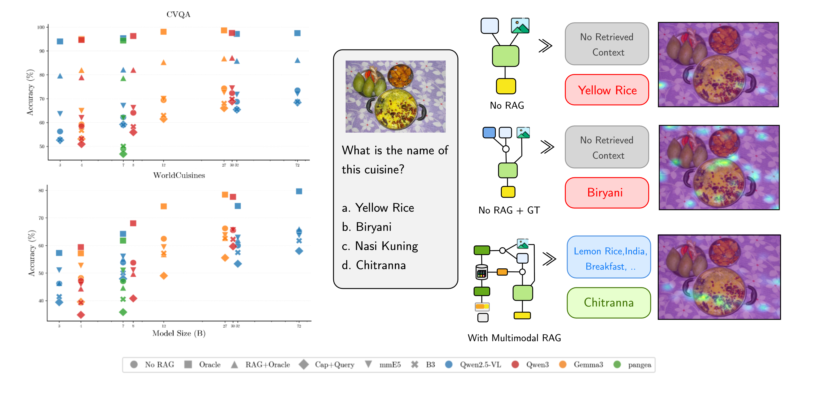

# M4-RAG: A Massive-Scale Multilingual Multi-Cultural Multimodal RAG

<p align="center">
  
</p>

## Table of Contents

- [Overview](#overview)
- [Setup](#setup)
- [Datasets](#datasets)
- [Repository Structure](#repository-structure)
- [Citation](#citation)
- [Contact](#contact)

## Overview

Vision-language models (VLMs) have achieved strong performance in visual question answering (VQA), yet they remain constrained by static training data. Retrieval-Augmented Generation (RAG) mitigates this limitation by enabling access to up-to-date, culturally grounded, and multilingual information; however, multilingual multimodal RAG remains largely underexplored.

We introduce **M4-RAG**, a massive-scale benchmark covering **42 languages** and **56 regional dialects and registers**, comprising over **80,000 culturally diverse image-question pairs** for evaluating retrieval-augmented VQA across languages and modalities. To balance realism with reproducibility, we build a controlled retrieval environment containing millions of carefully curated multilingual documents relevant to the query domains, approximating real-world retrieval conditions while ensuring consistent experimentation.

### Key Findings

Our systematic evaluation reveals a critical insight: **although RAG consistently benefits smaller VLMs, it fails to scale to larger models and often even degrades their performance**, exposing a fundamental mismatch between model size and current retrieval effectiveness. M4-RAG provides a foundation for advancing next-generation RAG systems capable of reasoning seamlessly across languages, modalities, and cultural contexts.

## Setup

### Prerequisites

We use Python 3.12.11.

### Setup with `uv` (Recommended)

```bash
# Clone the repository
git clone https://github.com/yourusername/M4-RAG.git
cd M4-RAG

# Install uv (if not already installed)
curl -LsSf https://astral.sh/uv/install.sh | sh

# Create and activate environment
uv venv
source .venv/bin/activate

# Install dependencies
uv pip install -r requirements.txt
```

### Alternative: pip Installation

```bash
# Create virtual environment
python3.12 -m venv venv
source venv/bin/activate

# Install dependencies
pip install -r requirements.txt
```

### Image Setup

After installation, you need to place image directories in the root folder:

```bash
# Create directories for images
mkdir -p cvqa_images images

# Download CVQA images from HuggingFace and place in cvqa_images/
# Download WorldCuisines images from HuggingFace and place in images/
```

The images are available as part of the respective HuggingFace datasets:
- CVQA images: Part of [`davidanugraha/cvqa`](https://huggingface.co/datasets/davidanugraha/cvqa)
- WorldCuisines images: Part of [`worldcuisines/vqa-v1.1`](https://huggingface.co/datasets/worldcuisines/vqa-v1.1)

## Datasets

### CVQA (Culturally-Aware Visual Question Answering)

- **HuggingFace**: [`davidanugraha/cvqa`](https://huggingface.co/datasets/davidanugraha/cvqa)
- **Format**: Multiple-choice VQA with culturally diverse images
- **Languages**: 32 languages with English and local language prompts
- **Categories**: Brands, Food, Geography, People, Animals, Art, Sports, Vehicles, etc.

```python
from datasets import load_dataset
cvqa = load_dataset("davidanugraha/cvqa", split="test")
```

### WorldCuisines

- **HuggingFace**: [`worldcuisines/vqa-v1.1`](https://huggingface.co/datasets/worldcuisines/vqa-v1.1)
- **Format**: Food-related visual question answering
- **Languages**: Multilingual food culture questions across 30 languages and dialects

```python
from datasets import load_dataset
worldcuisines = load_dataset("worldcuisines/vqa-v1.1", split="test")
```

### Wikipedia Retrieval Corpus

- **HuggingFace**: [`davidanugraha/M4-RAG`](https://huggingface.co/datasets/davidanugraha/M4-RAG)
- **Format**: JSONL with multilingual Wikipedia articles

```python
from datasets import load_dataset

cvqa_corpus = load_dataset("davidanugraha/M4-RAG", "cvqa", split="train")
worldcuisines_corpus = load_dataset("davidanugraha/M4-RAG", "worldcuisines", split="train")
```

Create a RAG configuration file by providing `rag_mode` and `save_retrieval_path` which contains the results of the retrieval offline (after chunking, embedding, and perform retrieval on the articles):

```json
{
    "rag_mode": "default",
    "save_retrieval_path": "data/annotations/cvqa_rag_top100k.json",
}
```

## Repository Structure

- **`captioning/`** - Create dense captions for images used in dataset generation
- **`dataset_gen/`** - Chunk Wikipedia articles and generate image/text embeddings for retrieval
- **`inference/`** - Run VQA evaluation with/without retrieval and assess RAG quality using Judge models
- **`evaluation/`** - Compute final accuracy scores, breakdowns by language/category, and confusion matrices
- **`scripts/`** - Helper utilities (create model configs, start/stop vLLM servers, aggregate results)

## Citation

If you use M4-RAG in your research, please cite our paper:

```bibtex
@article{anugraha2025m4rag,
  title={M4-RAG: A Massive-Scale Multilingual Multi-Cultural Multimodal RAG},
  author={Anugraha, David and Irawan, Patrick Amadeus and Singh, Anshul and Lee, En-Shiun Annie and Winata, Genta Indra},
  journal={arXiv preprint arXiv:2512.05959},
  year={2025},
  url={https://arxiv.org/abs/2512.05959}
}
```

## Contact

For questions or issues, please open an issue on GitHub or contact [David Anugraha](david.anugraha@gmail.com)
